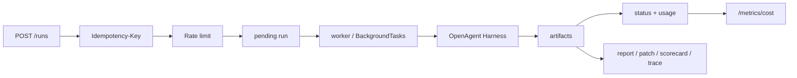

# OpenAgent Platform Backend

[](https://github.com/huangpengtao00-dotcom/openagent-platform-backend/actions/workflows/ci.yml)

FastAPI backend for service-wrapping OpenAgent Harness. The Harness executes coding-agent tasks; this Platform layer manages tasks, async runs, state, artifacts, idempotency, rate limiting, cache policy, and cost metrics.

## Demo Evidence

| Area | Current Evidence |
|---|---:|
| Automated tests | backend `52 passed`, frontend `22 passed` |
| Run states | `pending`, `running`, `pass`, `fail`, `timeout`, `cancelled` |
| Artifact endpoints | 5 run artifacts + cost metrics |
| Cost fields | prompt/completion/total tokens + estimated USD |
| Local safety | SQLite + in-memory cache/rate-limit fallback |
| Real-call guard | default backend gate + request opt-in + local key + budget cap |
| Process cancel | run status + Harness subprocess termination |
| Evaluation UI | scripted baseline + guarded DeepSeek + retry profile |

Highest-priority interview evidence:

1. Console screenshot after a `scripted baseline` run: status, mode, model, harness id, score, and artifact links.
2. `GET /runs/{id}` JSON for the same run: timestamps, status, and artifact links.
3. `/runs/{id}/report` or `/scorecard` screenshot: inspectable agent output.
4. `/evaluation/summary` screenshot or JSON: profile comparison, task-level table, failure distribution, and cost totals.

Reference Harness smoke:

| Task | Profile | Result | Tokens | Estimated Cost |
|---|---|---|---:|---:|
| HTTP 429 retry fix | `scripted baseline` | pass | 0 | `$0.00000` |

## Quantitative Evaluation Evidence

The console now leads with an Evaluation Dashboard instead of a single run view. The goal is to compare execution strategies on the same benchmark surface:

| Profile | Purpose | Cost posture |
|---|---|---|
| `scripted baseline` | deterministic local zero-cost baseline | no model call |
| `DeepSeek API` | real model evidence for the same agent workflow | guarded by `ALLOW_REAL_LLM_CALLS` and 1 CNY cap |
| `retry with context` | failure-aware retry after inspecting prior artifacts | guarded by the same real-call budget |

Dashboard metrics:

```json
{
  "total": 10,
  "passed": 10,
  "failed": 0,
  "pass_rate": 1.0,
  "avg_score": 96.5,
  "total_patch_lines": 182,
  "total_cost_usd": 0.00066,
  "failure_types": {
    "None": 10,
    "NoPatch": 0,
    "TestFailed": 0,
    "ScopeViolation": 0
  }
}
```

Live API:

```text
GET /evaluation/summary
```

The response includes:

- `summary`: benchmark totals, pass rate, average score, patch size, changed files, tests, failure distribution, tokens, cost, and duration.
- `profiles`: side-by-side comparison for local baseline, DeepSeek API, and retry strategy.
- `tasks`: one row per benchmark/run with `task_id`, `profile`, `status`, `score`, `patch_lines`, `changed_files`, `tests_passed`, `cost`, `failure_type`, and `report_link`.
- `retry_comparisons`: first attempt status, retry status, fail-to-pass flag, retry cost, retry patch lines, and failure-type changes.

Reproduce locally:

```powershell
.\Start_OpenAgent_Demo.bat
```

Then open the console and click:

1. `Evaluation` -> `Refresh dashboard`
2. `Run Control` -> profile `scripted baseline` -> `Start evaluation`
3. Return to `Evaluation` -> `Refresh dashboard`
4. Optional only after preflight: `DeepSeek API` or `Retry with context`

Interview line:

> I do not just show one successful agent run. I run different execution strategies against the same benchmark surface and compare pass rate, cost, patch size, changed files, failure type, trace, scorecard, and report links.



## Scope

```text
OpenAgent Harness  = coding-agent execution, patch, tests, trace, report
Platform Backend   = API control plane, worker, state, artifacts, cost governance
```

The backend never stores API keys and never reimplements the agent loop. It calls the Harness CLI through subprocess:

```bash
python -m openagent_harness.cli run <task.json> --mode local --model scripted --runs ./artifacts/harness_runs
```

`harness_task_path` is constrained to `HARNESS_ROOT`. Relative task paths are resolved under `HARNESS_ROOT`; absolute task paths must already be inside that directory. This prevents the API from being used to point the Harness at arbitrary local files.

Related repository:

- OpenAgent Harness: https://github.com/huangpengtao00-dotcom/openagent-harness

## Run Locally

```powershell
python -m venv .venv
.venv\Scripts\activate
python -m pip install --upgrade pip
pip install -e .[dev]
copy .env.example .env
pytest -q
uvicorn app.main:app --reload
```

Open:

```text
http://127.0.0.1:8000/docs
```

## Platform Console

The optional frontend console lives in `frontend/`. It is a lightweight React/Vite UI for showing Platform evidence: architecture boundary, run state, cancellation, artifacts, and cost metrics. It does not store API keys or call LLM providers directly.

Static presentation mode:

```powershell
cd frontend
npm install
npm run build
```

Then open:

```text
frontend/dist/index.html
```

The built HTML uses relative assets, so it can be opened directly like a static zip demo. In this mode it shows built-in sample data and does not require the backend.

Live API mode:

```powershell
cd frontend
npm install
npm run dev
```

Open:

```text
http://127.0.0.1:5173
```

The Vite dev server proxies `/api/*` to `http://127.0.0.1:8000/*`, so start the FastAPI backend separately when using live API actions. Without the backend, the console still opens with demo data for presentation.

One-command local demo:

Double-click:

```text
Start_OpenAgent_Demo.bat
```

Or run from PowerShell:

```powershell
powershell -NoProfile -ExecutionPolicy Bypass -File .\scripts\start_demo.ps1
```

This starts the FastAPI backend and the Vite Console in separate terminals, opens `http://127.0.0.1:5173`, and enables guarded real model calls with `ALLOW_REAL_LLM_CALLS=true`. A provider key such as `DEEPSEEK_API_KEY` is still required, and the backend budget gate remains active.

The live Console run page includes evaluation profiles:

- `scripted baseline`: zero-cost baseline for stable interview demos.
- `DeepSeek API`: guarded real model path, disabled unless server and request both opt in.
- `retry with context`: creates a retry run from the current failed run and folds it into the evaluation dashboard.

## API Smoke

```powershell
$task = @{
  name = "retry-429-real"
  description = "Fix HTTP 429 retry logic"
  harness_task_path = "benchmarks_realistic/retry-429-real/task.json"
} | ConvertTo-Json

Invoke-RestMethod -Method Post -Uri http://127.0.0.1:8000/tasks -ContentType "application/json" -Body $task

$run = @{
  task_id = 1
  mode = "local"
  model = "scripted"
  allow_llm_calls = $false
  timeout_seconds = 120
} | ConvertTo-Json

Invoke-RestMethod -Method Post -Uri http://127.0.0.1:8000/runs -Headers @{"Idempotency-Key"="demo-001"} -ContentType "application/json" -Body $run
Invoke-RestMethod http://127.0.0.1:8000/runs/1
```

Artifact endpoints:

```text
GET /runs/{run_id}/report
GET /runs/{run_id}/patch
GET /runs/{run_id}/scorecard
GET /runs/{run_id}/test-result
GET /runs/{run_id}/trace
GET /metrics/cost
POST /runs/{run_id}/cancel
```

`POST /runs/{run_id}/cancel` marks pending/running runs as `cancelled`. In local BackgroundTasks mode, the API process registry can terminate the active Harness subprocess directly. In API/worker split mode, the worker polls the database while the subprocess is running and terminates its own Harness process as soon as it observes cancellation. In a multi-machine production deployment, the same idea should move to the queue/worker control layer.

## Database Migrations

Local tests can still create tables directly through SQLAlchemy metadata, but the operational schema path is Alembic:

```powershell
alembic upgrade head
```

The baseline migration creates `tasks`, `runs`, and `usage`, including the idempotency constraint and `timeout_seconds`.

## Real DeepSeek Mode

Real calls require both:

1. local environment contains `DEEPSEEK_API_KEY`
2. Platform env sets `ALLOW_REAL_LLM_CALLS=true`
3. request body sets `"mode": "api"` and `"allow_llm_calls": true`

Real spending is bounded by request opt-in, a local provider key, the backend budget gate, rate limiting, and timeout handling. Do not commit `.env`.

For manual demos, keep total real API smoke spending under `REAL_API_BUDGET_LIMIT_CNY` (default `1.0` CNY). A single `deepseek-v4-flash` realistic task is expected to be tiny, but check `/metrics/cost` and `/evaluation/summary` after every real run.

## Scripted Mode vs API Mode

Use scripted mode for stable demos, interviews, and CI:

```json
{
  "mode": "local",
  "model": "scripted",
  "allow_llm_calls": false
}
```

Scripted mode does not call a model provider. It exercises the same Platform control flow and Harness artifact flow, but keeps cost at zero and avoids API-key risk.

Use API mode only for explicit low-budget smoke tests:

```json
{
  "mode": "api",
  "model": "deepseek-v4-flash",
  "allow_llm_calls": true
}
```

API mode needs `ALLOW_REAL_LLM_CALLS=true` and a local provider key such as `DEEPSEEK_API_KEY`. Keep keys in local environment or `.env`; never send them through request bodies, never store them in the database, and never commit them. `RunCreate.mode` only accepts `"local"` or `"api"`.

## Release Bundles

Build two local handoff folders:

```powershell
.\scripts\build_clean_release.ps1
```

Output:

```text
C:\Users\hpt\Documents\实习项目\OpenAgent-Release-Bundles\openagent-platform-runnable
C:\Users\hpt\Documents\实习项目\OpenAgent-Release-Bundles\openagent-platform-interview-clean
```

Both bundles exclude `.env`, `.venv`, `node_modules`, `runs`, `artifacts`, local databases, `.git`, zip files, logs, and cache directories. The runnable bundle includes backend and Harness source for local setup; the interview-clean bundle is the safer folder to share or zip.

## Worker Mode

For local demos, `AUTO_START_RUNS=true` lets FastAPI schedule runs with `BackgroundTasks`. For a more production-like split, set:

```env
AUTO_START_RUNS=false
```

Then start the API and worker separately:

```powershell
uvicorn app.main:app --reload
python -m app.worker
```

In this mode, `POST /runs` only writes a pending run. The worker polls pending runs and executes Harness subprocesses.

For a containerized API/worker/Redis split:

```powershell
copy .env.example .env
# Set HOST_HARNESS_ROOT to your local Harness checkout.
docker compose up --build
```

## Verification

```powershell
pytest -q
```

Expected result:

```text
52 passed
```

The tests cover health, idempotent run creation, artifact serving, path sandboxing, rate limiting, cache jitter, cost parsing, timeout classification, worker execution, evaluation summary aggregation, default Harness path discovery, and metrics aggregation.

## Cache Backend

With `ENABLE_REDIS=false`, cache and rate limiting use in-memory fallbacks for local demos. With `ENABLE_REDIS=true`, rate limiting and cache reads/writes use Redis; if Redis is unavailable, the service falls back to memory so local startup still works.

## Interview Materials

- `docs/architecture_diagram.md`
- `docs/coding_agent_evaluation.md`
- `docs/demo_evidence.md`
- `docs/demo_walkthrough.md`
- `docs/one_command_demo.md`
- `docs/deepseek_evidence_workflow.md`
- `docs/interview_playbook_cn.md`
