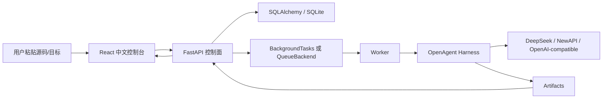

# OpenAgent Platform Backend

OpenAgent Platform 是一个面向 Coding Agent 的多模型评测平台：用户粘贴源码和需求，后端自动分析任务难度并生成评测草稿，用户确认后选择多个模型同时运行，最后在控制台里横向比较结果、证据、历史和成本。

这个仓库重点展示的是 Platform 层：FastAPI 控制面、SQLAlchemy 数据面、异步 worker/队列、Harness 执行集成、artifact 回写、历史评测管理、成本统计和中文前端控制台。

## 一句话定位

我不是做了一个“接入几个大模型的页面”，而是把 Coding Agent 的执行过程工程化成可复现、可比较、可追踪的评测系统。

主流程：

```text
粘贴源码和目标
  -> 后端判断难度并生成评测草稿
  -> 用户确认或二次修改
  -> 选择 DeepSeek / NewAPI 5.4 / NewAPI 5.5 等模型
  -> 创建一个 Evaluation，下挂多个 Run
  -> Worker 调 Harness 执行
  -> 回写 patch / test-result / trace / scorecard / report / usage
  -> Dashboard 展示结果矩阵、历史、失败原因和成本
```

## 当前主功能

- 源码分析：`POST /evaluation-drafts` 调用 `CodeDifficultyAnalyzer`，后端判断 `easy | medium | hard`，返回原因、风险因素和推荐执行策略。
- 多模型评测：`POST /evaluations` 一次创建一个 Evaluation 和多个 model run，同一任务横向对比。
- 历史管理：`GET /evaluations/history` 按评测任务聚合 run，可查看状态、模型、失败类型、最佳结果和成本。
- 结果矩阵：`GET /evaluations/{evaluation_id}/matrix` 展示单次评测下 task × model 的结构化结果。
- Artifact 证据：每个 run 暴露 report、patch、scorecard、test-result、trace、agent-run/source。
- 异步执行：本地 demo 用 `BackgroundTasks`，生产化路径可切到 `QueueBackend + Worker`。
- Redis 队列：`QUEUE_BACKEND=redis` 支持 API 入队、worker 出队、DB 原子抢占。
- 成本统计：`GET /metrics/cost` 按平台模型标签统计 token 与估算成本，重点展示 `DeepSeek API`、`NewAPI 5.4`、`NewAPI 5.5`。
- 中文控制台：前端围绕 Dashboard、New Evaluation、History/Runs、Evidence、Cost 展开，不要求用户理解 Harness 内部文件。

## 用户不会看到什么

主产品口径里不再强调：

- Harness CLI
- 手写 `task.json`
- 手写 `profiles.json`
- allowlist 细节
- 多租户表结构
- local scripted 作为主对比模型

这些仍然是系统内部实现或本地 fallback，但不是面向用户的主入口。对用户只讲：源码、任务、模型、评测、证据、历史、成本。

## 架构分层



| 层 | 作用 | 主要文件 |
|---|---|---|
| 前端展示层 | 中文工作台、评测创建、历史、证据、成本 | `frontend/src/App.tsx`, `frontend/src/api.ts` |
| API 控制面 | 创建 draft/evaluation/run，查询历史和 artifact | `app/main.py`, `app/schemas.py` |
| 业务服务层 | 生成任务、幂等、成本、历史矩阵、难度分析 | `app/services.py`, `app/difficulty_analyzer.py` |
| 数据面 | Task、Evaluation、Run、Usage、Workspace | `app/models.py`, `app/db.py` |
| 队列/worker | DB fallback、Redis queue、原子抢占、取消/跳过 | `app/run_queue.py`, `app/worker.py` |
| 执行面 | 调用 Harness，本地或 Docker executor | `app/harness_client.py` |
| 证据面 | patch、report、scorecard、trace、test-result | `artifacts/`, `/runs/{id}/...` |

## 关键接口

| API | 用途 |
|---|---|
| `POST /evaluation-drafts` | 用户粘贴源码后，后端生成评测草稿和难度判断 |
| `POST /evaluations` | 创建一次多模型评测 |
| `GET /evaluations/history` | 历史评测管理 |
| `GET /evaluations/{id}/matrix` | 单次评测结果矩阵 |
| `GET /runs` | run 目录 |
| `GET /runs/{id}` | run 详情 |
| `POST /runs/{id}/retry` | 失败后带上下文重试 |
| `POST /runs/{id}/cancel` | 取消 pending/running run |
| `GET /runs/{id}/report` | 模型执行报告 |
| `GET /runs/{id}/patch` | 代码修改 diff |
| `GET /runs/{id}/scorecard` | 评分与失败类型 |
| `GET /runs/{id}/test-result` | pytest 输出 |
| `GET /runs/{id}/trace` | Agent 原始轨迹 |
| `GET /runs/{id}/agent-run` | Agent loop 策略和步骤 |
| `GET /metrics/cost` | 模型成本聚合 |
| `GET /demo/status` | 当前 demo runtime 状态 |

## 本地启动

后端：

```powershell
python -m venv .venv
.venv\Scripts\activate
python -m pip install --upgrade pip
pip install -e .[dev]
copy .env.example .env
python -m pytest -q
uvicorn app.main:app --reload
```

前端：

```powershell
cd frontend
npm install
npm run dev
```

打开：

```text
http://127.0.0.1:5173
```

一键 demo：

```powershell
powershell -NoProfile -ExecutionPolicy Bypass -File .\scripts\start_demo.ps1 -NoBrowser -KeepDemoData
```

## 队列与 Worker

本地默认：

```env
AUTO_START_RUNS=true
QUEUE_BACKEND=db
```

API/worker 分离：

```env
AUTO_START_RUNS=false
QUEUE_BACKEND=redis
REDIS_URL=redis://localhost:6379/0
RUN_QUEUE_KEY=openagent:runs
```

启动 worker：

```powershell
python -m app.worker
```

Redis List 版本是 MVP：它能展示 API 入队、worker 消费、DB 状态回查、取消跳过、重复入队安全和 `pending -> running` 原子抢占。它还不是强可靠队列，worker pop 后崩溃可能丢失该队列项。生产化路线是 Redis Streams、processing queue、retry scanner 和 dead-letter。

## 主展示模型

明天演示优先讲这三个：

- DeepSeek API
- NewAPI 5.4
- NewAPI 5.5

`local scripted` 只作为本地零成本 fallback，不作为能力对比重点。`fighting` 是历史遗留的 OpenAI-compatible provider，可放到“其他接口”里，不作为主线。

## Benchmark 与模板

展示用模板：

- `docs/benchmarks/demo_templates_5_copy_paste.md`

15 个任务目录：

- `docs/benchmarks/benchmark_catalog_15_tasks_2026-06-25.md`
- `benchmark_templates/benchmark_catalog_15.json`

检查难度分类：

```powershell
powershell -ExecutionPolicy Bypass -File .\scripts\check_benchmark_templates.ps1
```

## 验证记录

最近验证：

```text
backend: python -m pytest -q
101 passed, 1 warning

frontend: npm.cmd test -- --run
5 test files passed, 39 tests passed

frontend build: npm.cmd run build
passed
```

## 面试材料

主入口只看这几份：

- `docs/面试统一口径_2026-06-25.md`
- `docs/OpenAgent_项目学习知识库_架构技术栈_2026-06-25.md`
- `docs/evaluation_workspace_flow.md`
- `docs/backend_design.md`
- `docs/benchmarks/demo_templates_5_copy_paste.md`

旧口径、旧演示材料和早期证据已归档到：

- `docs/_archive_legacy_20260625/`

## 当前边界

- 这是面试级工程系统，不宣称完整生产级 SaaS。
- 账号登录尚未接入，当前 tenant/workspace 是后端数据隔离基础，未来由登录账号自动映射。
- Redis List 队列是 MVP，不宣称 crash-safe。
- Docker executor 已有路径，但明天主讲重点应放在 Evaluation 闭环、worker/queue、artifact 证据、历史和成本。
