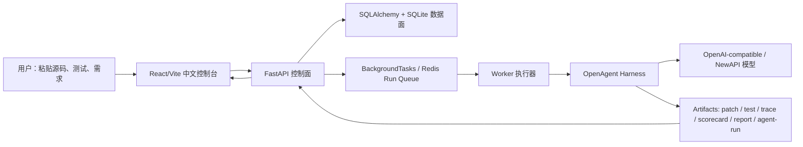

# OpenAgent 项目学习知识库：架构、技术栈与面试口径

更新时间：2026-06-25

## 1. 一句话定位

OpenAgent 不是一个“调用大模型生成代码”的玩具页面，而是一个 Coding Agent 评测与选型平台：用户把源码和需求贴进来，系统先整理成可执行评测任务，再同时调用多个模型跑同一任务，最后用 patch、测试结果、trace、scorecard、成本和历史记录做横向对比。

面试时可以这样说：

> 我做的是 Coding Agent 的工程化评测平台。Harness 负责让 Agent 在隔离 workspace 里读代码、改代码、跑测试、留下证据；Platform Backend 负责把 Harness 服务化，提供任务创建、异步执行、状态管理、历史管理、artifact 查询、成本统计和前端控制台。

## 2. 为什么要这样改

最开始的问题是：项目有一些模型接入和测试能力，但用户体验偏工程内部视角，容易让用户觉得“我到底要填什么”“评测失败为什么没反馈”“历史任务在哪里管理”。这次改造的核心不是堆功能，而是把产品出发点收回来：

1. 用户不是来理解 Harness task JSON 的，用户是来粘贴源码和描述目标的。
2. 用户不是只想跑一个模型，用户要同时跑多个模型，然后横向比较谁更稳、更便宜、更可解释。
3. 用户不是只要最终 pass/fail，用户要知道失败原因、测试输出、patch 内容、Agent 做了哪些 step。
4. 用户不是每次从零开始，用户要能管理历史评测、查看旧 run、失败后带上下文重试。
5. 多租户不应该作为前端概念吓用户；真正面向用户时应该是“不同账号看到自己的任务和历史”，底层再映射 tenant/workspace。

## 3. 用户流程

现在更适合讲成一条主流程：

```text
粘贴源码/测试/需求
  -> 生成评测草稿
  -> 用户确认或二次修改
  -> 选择多个模型 profile
  -> 同时创建多个 run
  -> worker/Harness 执行
  -> 前端查看状态、失败反馈、Agent Loop、证据
  -> 历史评测管理与复盘
```

用户能感知的是“评测任务”和“模型对比”，不是底层的 task.json、artifact path、worker queue。

## 4. 总体架构



可以把系统拆成 6 层理解：

| 层 | 作用 | 主要代码 |
|---|---|---|
| 前端控制台 | 降低使用门槛，展示评测、run、证据、成本、历史 | `frontend/src/App.tsx`, `frontend/src/api.ts`, `frontend/src/domain.ts` |
| API 控制面 | 接收任务、创建 run、查状态、查 artifact、取消/重试 | `app/main.py`, `app/schemas.py` |
| 数据面 | 存任务、run、usage、workspace 归属 | `app/models.py`, `app/db.py` |
| 执行调度 | BackgroundTasks 本地模式，Redis/worker 生产化路径 | `app/run_queue.py`, `app/worker.py`, `app/process_manager.py` |
| Harness 执行面 | Agent loop、工具调用、patch、测试、评分、报告 | `02_OpenAgent_Harness/src/openagent_harness/*` |
| 证据面 | 所有 run 的可审计产物 | `artifacts/`, `/runs/{id}/patch`, `/scorecard`, `/test-result`, `/trace`, `/agent-run` |

## 5. 核心实体

| 实体 | 你要怎么理解 | 面试追问点 |
|---|---|---|
| Task | 一次评测任务，包含目标、源码快照、测试命令、allowlist | 为什么不直接传 prompt？因为要变成可复现任务 |
| Run | 某个模型对某个任务的一次执行 | 状态机、失败类型、超时、取消、重试 |
| Usage | token 和成本统计 | 真实模型调用要能估算成本 |
| Workspace | 任务隔离范围 | 前端不强调“租户”，账号体系可映射到 workspace |
| Artifact | run 的证据文件 | patch、trace、scorecard、test-result 才能证明不是口头 claim |

## 6. API 地图

| API | 用户动作 | 后端职责 |
|---|---|---|
| `POST /evaluation-drafts` | 用户粘贴源码后，先整理任务草稿 | 调用 `CodeDifficultyAnalyzer` 判断 easy/medium/hard，返回原因、风险因素和策略建议 |
| `POST /evaluations` | 选择多个模型后提交评测 | 生成 task，创建多条 run，入队执行 |
| `GET /evaluations/history` | 查看历史评测 | 按任务聚合 run 状态、最佳结果、失败反馈 |
| `GET /evaluations/{evaluation_id}/matrix` | 查看一次评测的横向矩阵 | 按 Evaluation 聚合 task x model 结果、成本和失败反馈 |
| `DELETE /evaluations/{task_id}` | 管理/删除评测任务 | 删除任务或阻止删除运行中任务 |
| `GET /runs` | 查看 run 目录 | 展示所有 run 的状态、模型、artifact 路径 |
| `GET /runs/{run_id}` | 查看 run 详情 | 返回状态、时间、模型、usage、failure type |
| `POST /runs/{run_id}/retry` | 失败后带上下文重试 | 汇总失败证据，创建 retry run |
| `GET /runs/{run_id}/agent-run` | 查看 Agent Loop 策略与 step | 暴露 `api_agent_run.json`，前端展示自适应策略 |
| `GET /runs/{run_id}/patch` | 查看代码修改 | 证明模型真的改了什么 |
| `GET /runs/{run_id}/test-result` | 查看测试输出 | 解释为什么 pass/fail |
| `GET /runs/{run_id}/scorecard` | 查看评分卡 | 横向比较质量 |
| `GET /runs/{run_id}/trace` | 查看原始轨迹 | 排查 Agent 每一步行为 |
| `GET /evaluation/summary` | 看总览指标 | pass rate、成本、patch lines、failure type |
| `GET /demo/status` | 看运行环境 | Redis、worker、executor、workspace/runtime 状态 |

## 7. Harness 的 Agent Loop

## 7. CodeDifficultyAnalyzer

这次要讲清楚：难度不是前端让用户手动选，而是后端根据代码和目标自动判断。

输入：

| 字段 | 说明 |
|---|---|
| `source_code` | 用户粘贴或上传的源码 |
| `filename` | 文件路径，用于判断跨文件/模块语义 |
| `user_goal` | 用户自然语言目标，用于判断是否模糊 |
| `tests` | 可选测试内容，用于判断是否缺少可验收依据 |

输出：

| 字段 | 说明 |
|---|---|
| `difficulty_level` | `easy` / `medium` / `hard` |
| `difficulty_score` | 0-100 分 |
| `reasons` | 面向用户解释为什么这么判 |
| `risk_factors` | 面向系统的风险标签，如 `missing_tests`、`async_concurrency` |
| `suggested_strategy` | 对 Agent Loop、上下文、重试、QualityGate 的建议 |

判断依据包括代码行数、函数/类数量、嵌套深度、分支数量、IO/网络/数据库/异步/并发、外部依赖、是否有测试、目标是否模糊，以及修改是否可能跨多个文件。

面试讲法：

> 我没有让用户手动选择“简单/中等/困难”，而是在 `POST /evaluation-drafts` 里新增 `CodeDifficultyAnalyzer`。用户粘贴代码后，后端会用 AST 和规则信号判断任务难度，并给出 reasons、risk factors 和 suggested strategy。前端只展示这个判断，让用户理解为什么系统建议 short context、标准 Agent Loop，还是更长 budget 和严格 QualityGate。

## 8. Harness 的 Agent Loop

Harness 的核心不是“把需求发给模型”，而是一个受控循环：

```text
模型输出 JSON action
  -> Harness 解析 action
  -> 调用 read_file/search_repo/edit_file/run_command 等工具
  -> 得到 observation
  -> observation 继续喂给模型
  -> 直到 finish 或达到最大 step
```

本轮改进点：

1. 支持 adaptive LoopStrategy：按任务复杂度选择 simple / standard / deep。
2. 对 invalid JSON 或不规范 action 给模型 recoverable feedback，不是一失败就结束。
3. `api_agent_run.json` 里记录 strategy 和 steps，Platform 新增 `/runs/{id}/agent-run` 暴露给前端。
4. 前端 Runs 页面新增 Agent Loop 策略与 Agent Steps 摘要，让失败和执行过程可解释。

面试讲法：

> 以前 Agent Loop 更像固定轮数的脚本。现在我把 loop 策略显式化，简单任务少跑、复杂任务多给上下文和步骤预算，并把 strategy 和 steps 作为 artifact 暴露到前端。这样不只是跑完，还能解释 Agent 为什么这么跑、跑到哪一步失败。

## 9. 多模型横向对比

这个项目的出发点是“同一任务，同时跑多个模型”，不是“接入各种大模型后让用户自己试”。

对比维度：

| 维度 | 意义 |
|---|---|
| pass/fail | 是否通过验收测试 |
| score | 综合质量评分 |
| patch lines | 修改规模，过大可能代表不稳定 |
| changed files | 是否越界改太多 |
| failure type | 失败原因分类 |
| duration | 执行耗时 |
| tokens/cost | 模型使用成本 |
| trace/steps | 可解释性和排错证据 |

你已经跑通过真实 NewAPI 对比：

| Task | Run | Model | 结果 | 证据 |
|---|---:|---|---|---|
| `NewAPI 5.4 5.5 final both pass 20260625` | 23 | `gpt-5.4` | pass, score 100 | pytest `2 passed` |
| 同上 | 24 | `gpt-5.5` | pass, score 100 | pytest `2 passed` |

面试时不要暴露 key，只讲模型 profile 和 OpenAI-compatible provider path。

## 10. Redis / Worker / Docker 怎么讲

不要把这些讲成“我为了高级而加的组件”，要讲成执行链路自然演进：

### BackgroundTasks

适合本地 demo：API 收到 run 后直接通过 FastAPI BackgroundTasks 启动后台执行，简单、少依赖。

### Redis Queue

适合 API 与 worker 分离：API 只负责创建 run 和入队，worker 从 Redis list 里取 run_id 执行。Redis 不可用时可以回退到扫描数据库 pending rows，保证本地 demo 不因为 Redis 掉了就完全不可用。

### Worker

适合长任务、失败重试、取消、超时控制。worker 执行前会重新检查数据库状态，避免已经取消的 run 继续跑。

### Docker Executor

适合隔离 Harness 执行环境。host worker 可以通过 Docker 启动 Harness 容器，把 task 和 artifacts 目录挂载进去，执行完成后 Platform 仍然通过 artifact API 提供结果。

面试讲法：

> 我保留了本地 BackgroundTasks 模式，方便 demo；同时提供 Redis + worker 模式，把 API 控制面和长任务执行面分开。Docker executor 是下一步隔离运行环境的路径，不让不同任务互相污染依赖。

## 11. 前端为什么要继续简化

前端应围绕用户决策，而不是围绕后端表结构。

现在更合理的页面逻辑：

1. Dashboard：看系统状态、最近评测、总体通过率/成本。
2. New Evaluation：用户粘贴源码和需求，后端判断代码难度并生成草稿，用户确认后选择模型。
3. History / Runs：先按 Evaluation 打开结果矩阵，再进入单个 run 的状态、失败诊断、Agent Loop、step 摘要。
4. Evidence：看 patch、test-result、scorecard、trace、report。
5. History：管理历史评测，查看最佳通过/最新 run，删除不用的评测。
6. Cost：看 token 与成本趋势。

不要把“租户”作为前端大概念展示给普通用户。真实产品里应该是登录账号后自动隔离数据；tenant/workspace 是后端数据隔离实现。

## 12. 测试与证据

本轮已验证：

```powershell
cd C:\Users\hpt\Documents\实习项目\Interview-Project-Bundle-20260617-233344\01_OpenAgent_Platform_Backend
python -m pytest tests/test_api.py::test_get_agent_run_artifact_exposes_strategy tests/test_api.py::test_evaluation_history_includes_failure_feedback -q
```

结果：

```text
2 passed, 1 warning
```

前端：

```powershell
cd C:\Users\hpt\Documents\实习项目\Interview-Project-Bundle-20260617-233344\01_OpenAgent_Platform_Backend\frontend
npm.cmd test -- --run
npm.cmd run build
```

结果：

```text
backend: 101 passed, 1 warning
frontend: 5 test files passed, 39 tests passed
production build passed
```

Harness：

```text
31 passed
```

真实模型：

```text
gpt-5.4 / gpt-5.5 同任务最终均 pass
```

## 13. 你明天面试怎么讲

### 60 秒版

我的 OpenAgent 项目分成 Harness 和 Platform 两层。Harness 负责 Coding Agent 的实际执行：读取代码、搜索仓库、局部编辑、运行测试，并生成 patch、trace、scorecard、report 等证据。Platform Backend 基于 FastAPI 把它服务化，支持源码粘贴后的难度判断、任务提交、多个模型同时评测、Evaluation 结果矩阵、run 状态机、异步 worker、Redis 队列、artifact 查询、失败上下文重试和成本统计。前端控制台则把流程简化成“粘贴源码 -> 后端判断难度并整理草稿 -> 选择模型 -> 打开 Evaluation 横向矩阵 -> 查看历史和证据”。我重点做的是把 Agent 从一次性 demo 变成可复现、可观测、可比较的工程系统。

### 3 分钟版

我一开始发现仅仅接入模型意义不大，因为用户真正想知道的是：同一段代码和同一个修复目标，不同模型谁更可靠、谁成本更低、失败在哪里。于是我把系统分成控制面和执行面。控制面用 FastAPI + SQLAlchemy 管理 Task、Run、Usage 和 workspace，提供 `/evaluations`、`/runs`、`/evaluation/summary`、artifact endpoints。执行面由 Harness 完成，它通过 JSON action loop 调工具，产出 patch、测试结果、trace 和 scorecard。为了支持长任务和多模型并发，我补了 BackgroundTasks、本地 worker、Redis queue 和 Docker executor 的演进路径。为了让前端不复杂，我把用户流程收敛为源码粘贴、任务草稿确认、多模型选择、运行详情、证据查看和历史管理。

### 深挖版

可以按四个难点展开：

1. Agent Loop：模型必须输出结构化 JSON action，Harness 只执行受控工具，invalid JSON 会进入 recoverable feedback。
2. 评测证据：每个 run 都保留 patch、test-result、scorecard、trace、report 和 agent-run strategy，不靠模型自述证明效果。
3. 异步执行：API 负责创建和查询，worker 负责执行；Redis 负责队列，数据库负责最终状态，取消/超时要能落库。
4. 用户体验：前端只呈现任务、模型、run、证据和历史；tenant/workspace 留在后端，未来由账号体系自动映射。

## 13. 常见追问

### 为什么不直接让用户上传 task.json？

因为目标用户不应该理解 Harness 内部协议。更好的体验是用户粘贴源码和需求，系统生成草稿，用户确认后再执行。task.json 是系统内部可复现格式。

### 为什么要做多模型并发？

Coding Agent 的价值不只看单次生成，而是看同一任务下不同模型的稳定性、成本和失败类型。并发评测能让用户更快完成选型。

### 为什么失败也要展示 Agent Loop？

失败往往比成功更能说明系统质量。失败时如果只有 429 或 fail，用户不知道是模型没改、测试没过、格式错、还是工具调用失败。Agent steps 能把失败定位到具体环节。

### 为什么前端不强调多租户？

多租户是后端隔离能力，不是普通用户的操作概念。产品上应该是登录账号后自动隔离数据；面试可以讲 tenant/workspace 是为账号体系和团队空间预留的数据边界。

### 现在是不是生产级？

不是完整生产系统，但已经具备生产系统的核心形态：API 控制面、异步执行、队列演进、artifact 证据、状态机、失败反馈、成本统计和可测试性。生产化还需要更完整的认证、权限、对象存储、分布式日志、任务配额和部署监控。

## 14. 技术栈学习路线

按优先级学：

1. FastAPI：依赖注入、Pydantic schema、路由组织、异常处理。
2. SQLAlchemy：模型关系、查询、状态更新、事务边界。
3. 异步任务：BackgroundTasks、worker polling、Redis list queue、取消与超时。
4. Agent Loop：JSON action protocol、tool registry、observation、recoverable feedback。
5. Artifact 设计：patch/test/trace/scorecard/report 为什么要分开存。
6. React/Vite：API client、domain types、状态切换、失败/空状态展示。
7. 测试：pytest 覆盖 API 和 worker，Vitest 覆盖前端状态与渲染。
8. Docker：API/worker/Redis 分服务，Harness executor 隔离。
9. 面试表达：每个技术点都要能对应“解决了什么用户或工程问题”。

## 15. 下一步改进路线

近期优先：

1. 把 New Evaluation 页面继续收敛成“源码粘贴 + 自动草稿 + 用户确认 + 模型选择”四步。
2. History 页面加强筛选、搜索、批量清理和复跑入口。
3. Runs 页面展示更清楚的失败原因：HTTP 429、模型响应格式错误、测试失败、超时、无 patch。
4. 给每次评测生成一份可下载的 comparison report，方便面试展示。
5. 给真实模型调用增加 profile 健康检查：模型 ID、base URL、限流、最近成功时间。

中期：

1. 用户账号登录后自动映射 workspace，不再让用户看到 tenant。
2. Redis worker 支持并发数、队列优先级、重试次数和死信队列。
3. Artifact 从本地文件迁到 S3/MinIO，对外只暴露 signed URL 或 API 代理。
4. Trace 支持前端时间线回放。
5. Evaluation memory 从 JSONL 演进到 SQLite FTS 或向量检索，用于失败经验复用。

## 16. 记忆口诀

你面试时可以记这一串：

```text
用户贴源码 -> 平台整理任务 -> 多模型同时跑 -> Harness 留证据 -> 后端管状态和成本 -> 前端做横向对比和历史管理
```

再记一个工程分层：

```text
控制面 FastAPI
数据面 SQLAlchemy
调度面 Worker/Redis
执行面 Harness
证据面 Artifacts
展示面 React
```
