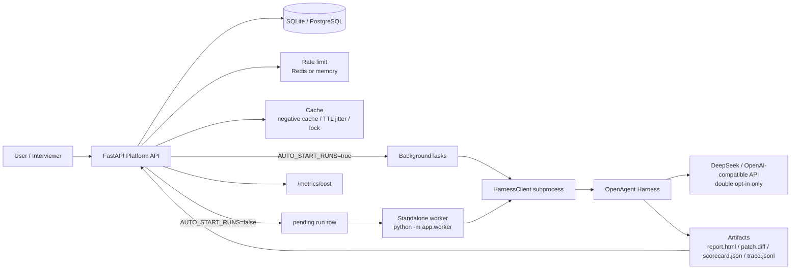

# Architecture Diagram



## Interview Explanation

OpenAgent Harness is the execution plane. It edits code, runs tests, enforces policy, and writes evidence artifacts.

OpenAgent Platform Backend is the control plane. It accepts tasks, creates runs, enforces idempotency and rate limits, schedules work, stores state, serves artifacts, and aggregates cost.

The important boundary is that the Platform never reimplements the agent loop and never stores raw API keys. It only calls the Harness CLI and manages the lifecycle around it.

## Request Flow

```text
POST /runs
  -> validate task and idempotency key
  -> apply per-user rate limit
  -> create pending run
  -> background task or standalone worker claims run
  -> HarnessClient calls OpenAgent Harness CLI
  -> Harness writes artifacts
  -> worker stores status, artifact path, usage and cost
  -> user reads /runs/{id}/report, /patch, /scorecard, /metrics/cost
```

