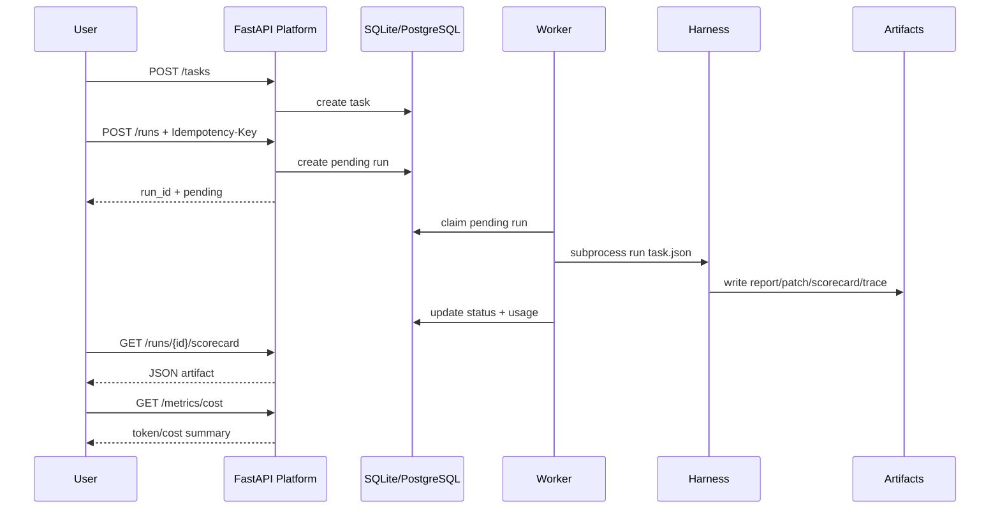

# Demo Evidence

This document starts with the evidence an interviewer should inspect first: quantified runs, screenshot targets, and reproducible artifact links. Architecture details come after the proof.

## Evidence Pack Priority

| Priority | Evidence | Why it matters in an interview |
|---:|---|---|
| P0 | Screenshot of Console run page after a real API run | Proves the UI can start and observe a real coding-agent evaluation. |
| P0 | `GET /runs/{id}` JSON for the same run | Shows status, model, tokens, cost, artifact links, and timestamps in machine-readable form. |
| P0 | Screenshot of `/runs/{id}/report` or scorecard | Shows the agent output is reviewable, not just a success flag. |
| P0 | Screenshot or JSON of `/metrics/cost` | Proves the platform can quantify spend by model. |
| P1 | `patch.diff`, `test_result.json`, `trace.jsonl` | Lets the interviewer inspect patch quality, tests, and action trace. |
| P1 | Safe scripted profile screenshot | Shows the zero-cost baseline and explains why demos do not need to spend by default. |

## Latest Verified Local Evidence

Verified locally on 2026-06-17 after starting the Platform API and Console in live mode:

| Run | Agent profile | Task | Status | Harness run id | Prompt | Completion | Total tokens | Estimated cost |
|---:|---|---|---|---|---:|---:|---:|---:|
| 2 | `Real DeepSeek retry-429` | HTTP 429 retry fix | `pass` | `deepseek-real-retry-429-32b3023d` | 3727 | 432 | 4159 | `$0.00064274` |

Current local cost summary from `/metrics/cost`:

| Model | Runs | Tokens | Estimated cost |
|---|---:|---:|---:|
| `deepseek-v4-flash` | 2 | 8502 | `$0.001337` |

The Console run page should show: `实时接口`, `Run #2`, `pass`, `mode=api`, `model=deepseek-v4-flash`, `harness=deepseek-real-retry-429-32b3023d`, and `usage=$0.00064`.

## Screenshot Checklist

Capture these in order for the interview evidence folder:

1. **Console: evaluation profile selector** with `Safe scripted retry-429`, `Real DeepSeek retry-429`, and `Real DeepSeek config-loader`.
2. **Console: real run completed** showing `Run #2 pass`, `mode=api`, `model=deepseek-v4-flash`, harness id, and usage.
3. **API JSON: `GET /runs/2`** showing `status=pass`, token usage, cost, and artifact links.
4. **Artifact: `/runs/2/report` or `/runs/2/scorecard`** showing the generated evaluation result.
5. **Cost: `/metrics/cost`** showing model-level total runs, tokens, and estimated USD.
6. **Safety proof**: a rejected API-mode request when `ALLOW_REAL_LLM_CALLS=false`, if time allows.

## At A Glance

| Capability | Evidence | Interview Point |
|---|---|---|
| Task submission | `POST /tasks` | The platform stores Harness task metadata. |
| Run orchestration | `POST /runs` | API returns immediately with a run id. |
| State tracking | `pending/running/pass/fail/timeout/cancelled` | Runs are observable instead of hidden subprocesses. |
| Artifact access | report, patch, scorecard, test-result, trace | Agent output is inspectable and reviewable. |
| Cost governance | `/metrics/cost` | Usage is summarized by model. |
| Agent profiles | Console evaluation selector | Same control plane can run safe scripted and real API profiles. |
| Idempotency | `Idempotency-Key` | Repeated submissions do not trigger duplicate runs. |
| Rate limit | Redis or memory fallback | Real LLM calls are protected from accidental bursts. |
| Cache policy | negative cache, lock shape, TTL jitter | Common cache failure modes are addressed. |

## Demo Flow



## Metrics Snapshot

Local verification:

```text
Backend: python -m pytest -q
31 passed

Frontend: npm test -- --run
13 passed
```

Reference real Harness smoke:

| Metric | Value |
|---|---:|
| Task | HTTP 429 retry fix |
| Result | pass |
| Test result | 4/4 passed |
| Estimated cost | `$0.00064274` for the latest UI-triggered real run |

Benchmark summary shape:

```json
{
  "suite": "openagent-harness-smoke",
  "total_tasks": 10,
  "passed_tasks": 10,
  "pass_rate": 1.0,
  "models": [
    {
      "model": "scripted",
      "tasks": 10,
      "passed": 10,
      "estimated_cost_usd": 0.0
    },
    {
      "model": "deepseek-v4-flash",
      "tasks": 1,
      "passed": 1,
      "estimated_cost_usd": 0.00064274
    }
  ]
}
```

Platform cost response shape:

```json
{
  "total_runs": 1,
  "total_tokens": 15,
  "estimated_cost_usd": 0.001,
  "by_model": [
    {
      "model": "scripted",
      "runs": 1,
      "tokens": 15,
      "estimated_cost_usd": 0.001
    }
  ]
}
```

## Artifact Evidence

The Platform exposes a small artifact contract instead of asking users to inspect worker logs.

| Endpoint | Purpose | Response Type |
|---|---|---|
| `GET /runs/{run_id}/report` | Human-readable run report | HTML |
| `GET /runs/{run_id}/patch` | Code diff | text/plain |
| `GET /runs/{run_id}/scorecard` | Machine-readable score | JSON |
| `GET /runs/{run_id}/test-result` | Test evidence | JSON |
| `GET /runs/{run_id}/trace` | Tool/action timeline | JSONL text |

## Failure Feedback

Run failures are not collapsed into one generic error.

| Failure | Platform Feedback |
|---|---|
| Harness test failure | `status=fail`, `failure_type` from Harness |
| Subprocess timeout | `status=timeout`, `failure_type=timeout` |
| User cancellation | `status=cancelled` |
| Missing artifact | HTTP 404, no server crash |
| Unsafe artifact path | HTTP 400 |

## Interview Summary

The project is positioned as an Agent Backend control plane:

- It does not reimplement the Agent loop.
- It makes Agent runs observable through state, artifacts, and cost metrics.
- It protects real LLM calls with idempotency, rate limiting, timeout handling, and double opt-in.
- It is intentionally local-demo friendly while leaving clear production upgrade paths.
