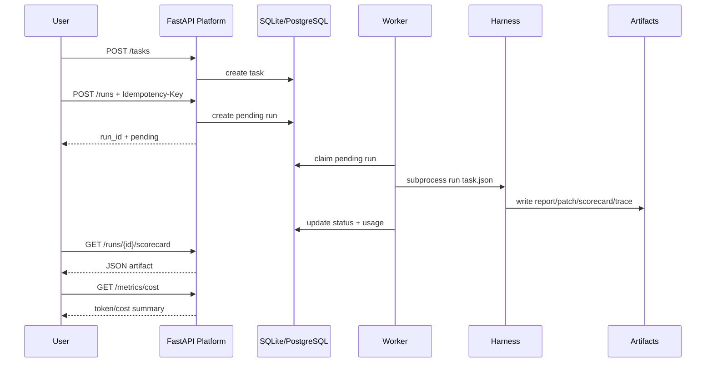

# Demo Evidence

This document collects the evidence an interviewer can inspect quickly: what the backend runs, what it records, and which metrics are already available.

## At A Glance

| Capability | Evidence | Interview Point |
|---|---|---|
| Task submission | `POST /tasks` | The platform stores Harness task metadata. |
| Run orchestration | `POST /runs` | API returns immediately with a run id. |
| State tracking | `pending/running/pass/fail/timeout/cancelled` | Runs are observable instead of hidden subprocesses. |
| Artifact access | report, patch, scorecard, test-result, trace | Agent output is inspectable and reviewable. |
| Cost governance | `/metrics/cost` | Usage is summarized by model. |
| Idempotency | `Idempotency-Key` | Repeated submissions do not trigger duplicate runs. |
| Rate limit | Redis or memory fallback | Real LLM calls are protected from accidental bursts. |
| Cache policy | negative cache, lock shape, TTL jitter | Common cache failure modes are addressed. |

## Demo Flow



## Metrics Snapshot

Local verification:

```text
pytest -q
25 passed
```

Reference real Harness smoke:

| Metric | Value |
|---|---:|
| Task | HTTP 429 retry fix |
| Result | pass |
| Test result | 4/4 passed |
| Estimated cost | ~$0.00066 |

Benchmark summary shape:

```json
{
  "suite": "openagent-harness-smoke",
  "total_tasks": 10,
  "passed_tasks": 10,
  "pass_rate": 1.0,
  "models": [
    {
      "model": "scripted",
      "tasks": 10,
      "passed": 10,
      "estimated_cost_usd": 0.0
    },
    {
      "model": "deepseek-v4-flash",
      "tasks": 1,
      "passed": 1,
      "estimated_cost_usd": 0.00066
    }
  ]
}
```

Platform cost response shape:

```json
{
  "total_runs": 1,
  "total_tokens": 15,
  "estimated_cost_usd": 0.001,
  "by_model": [
    {
      "model": "scripted",
      "runs": 1,
      "tokens": 15,
      "estimated_cost_usd": 0.001
    }
  ]
}
```

## Artifact Evidence

The Platform exposes a small artifact contract instead of asking users to inspect worker logs.

| Endpoint | Purpose | Response Type |
|---|---|---|
| `GET /runs/{run_id}/report` | Human-readable run report | HTML |
| `GET /runs/{run_id}/patch` | Code diff | text/plain |
| `GET /runs/{run_id}/scorecard` | Machine-readable score | JSON |
| `GET /runs/{run_id}/test-result` | Test evidence | JSON |
| `GET /runs/{run_id}/trace` | Tool/action timeline | JSONL text |

## Failure Feedback

Run failures are not collapsed into one generic error.

| Failure | Platform Feedback |
|---|---|
| Harness test failure | `status=fail`, `failure_type` from Harness |
| Subprocess timeout | `status=timeout`, `failure_type=timeout` |
| User cancellation | `status=cancelled` |
| Missing artifact | HTTP 404, no server crash |
| Unsafe artifact path | HTTP 400 |

## Interview Summary

The project is positioned as an Agent Backend control plane:

- It does not reimplement the Agent loop.
- It makes Agent runs observable through state, artifacts, and cost metrics.
- It protects real LLM calls with idempotency, rate limiting, timeout handling, and double opt-in.
- It is intentionally local-demo friendly while leaving clear production upgrade paths.
